### Tutorial:Setting Up a Library Management System

**Prepared by**:Taranpreet Kaur & Kusum  
  

#### Setting Up Domain and Basic Configurations

1. **Create and Start Site**:
    ```bash
    fm create sdg24.com
    fm start sdg24.com
    ```

2. **Edit Hosts File**:
    ```bash
    su
Taranpreet-codes/TEMP

 main

Go to file

    Password:
    root@debian:~# nano /etc/hosts
    ```
    Add the following lines:
    ```plaintext
    127.0.0.1    localhost
    127.0.0.1    sdg24.com
    ```
    Exit root:
    ```bash
    root@debian:~# exit
    ```

3. **Enter Frappe Shell**:
    ```bash
    cd frappe
    taranpreet@debian:~/frappe$ fm shell sdg24.com
    ```

#### Creating and Installing the App

1. **Create New App**:
    ```bash
    bench new-app lib_man_sys
    ```

2. **Install App**:
    ```bash
    bench install-app lib_man_sys
    ```

3. **Access the App**:
    - Open a browser and go to `sdg24.com`.
   
     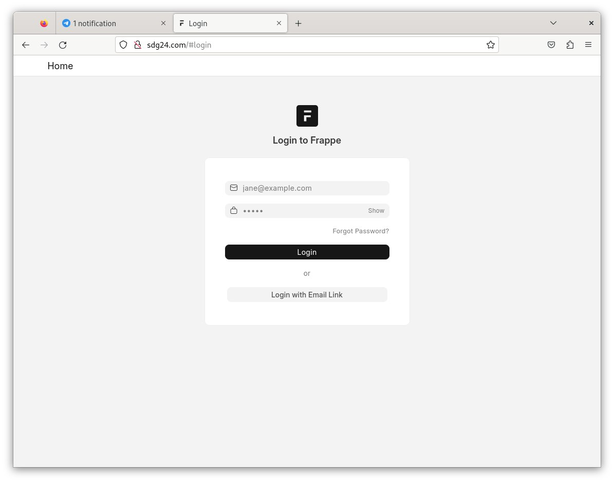
 - Login with `username = administrator` and `password = admin`.

 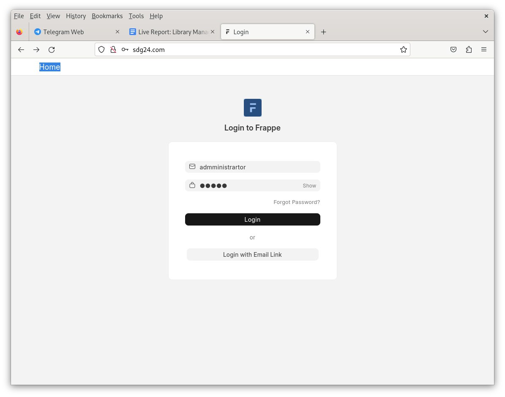   
  - Click on the profile icon (top right), then select "Switch to Desk".
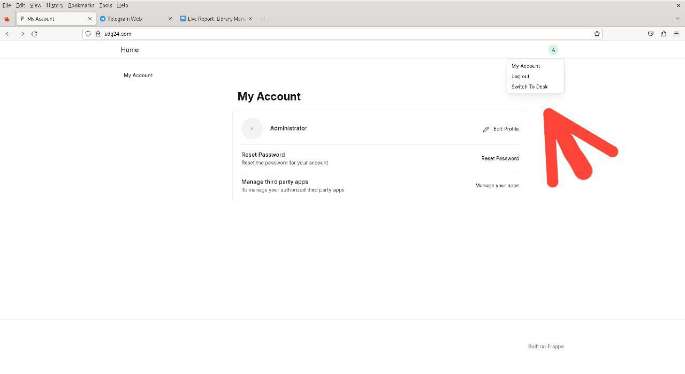
#### Creating Doctypes

1. **Create Doctype: Article**
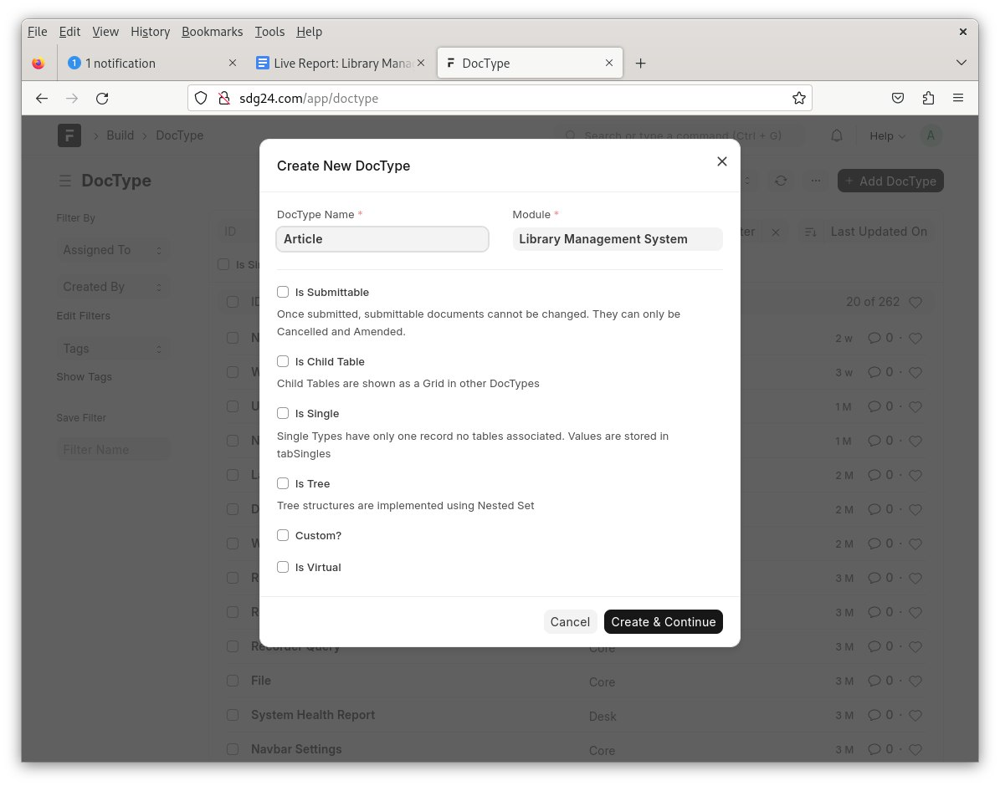 
    - **Module**: Lib Man Sys
    - **Fields**:
        - Article Name (Data, Mandatory)
        - Image (Attach Image)
        - Author (Data)
        - Description (Text Editor)
          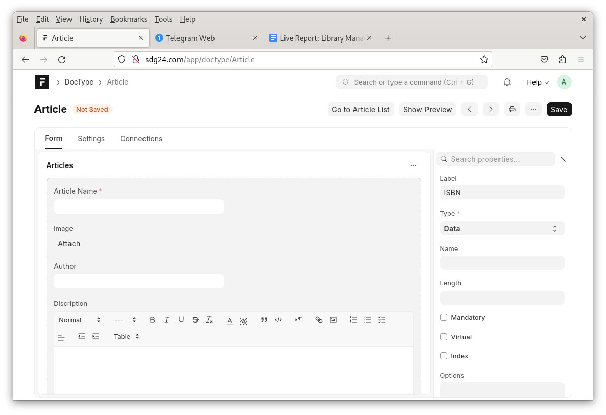
        - ISBN (Data)
        - Status (Select: Issued, Available)
          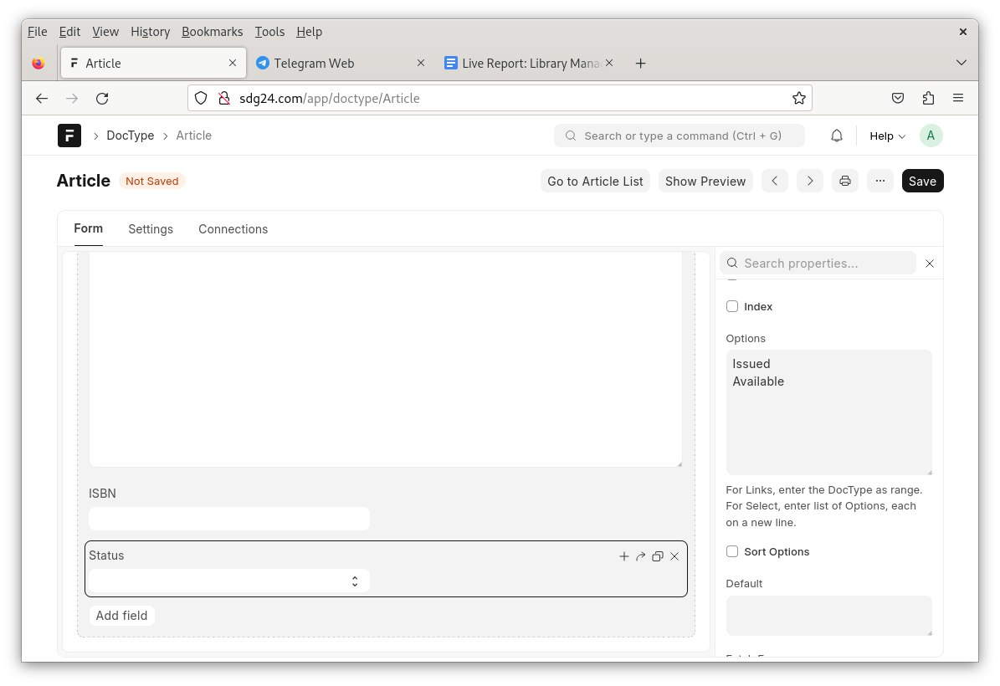
        - Publisher (Data)
    - Save the Doctype.
 go to article list

      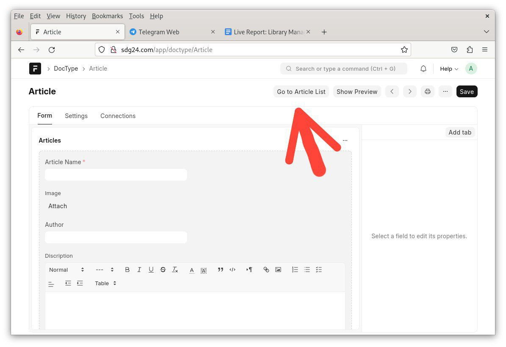
      Add article
      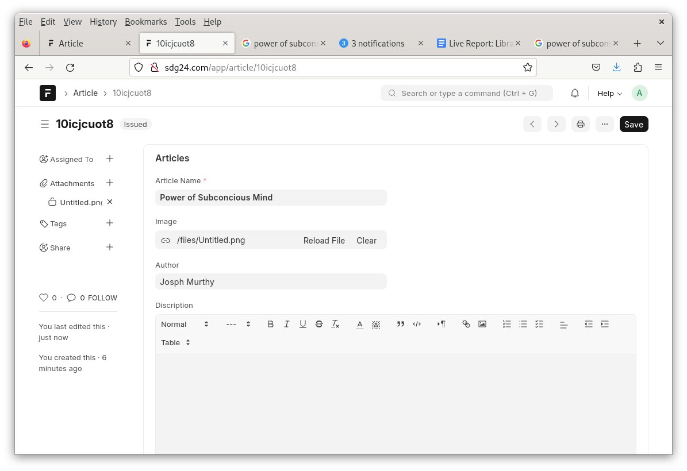
      Go to settings of article doctype
      add roles
      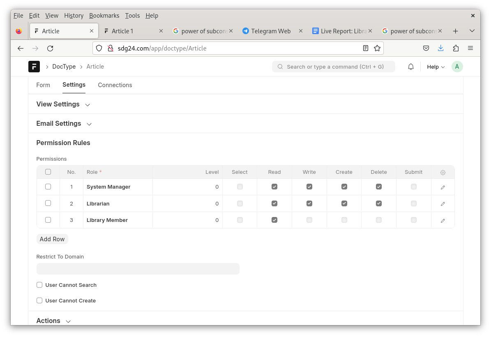
      
      

3. **Create Doctype: Library Member**
   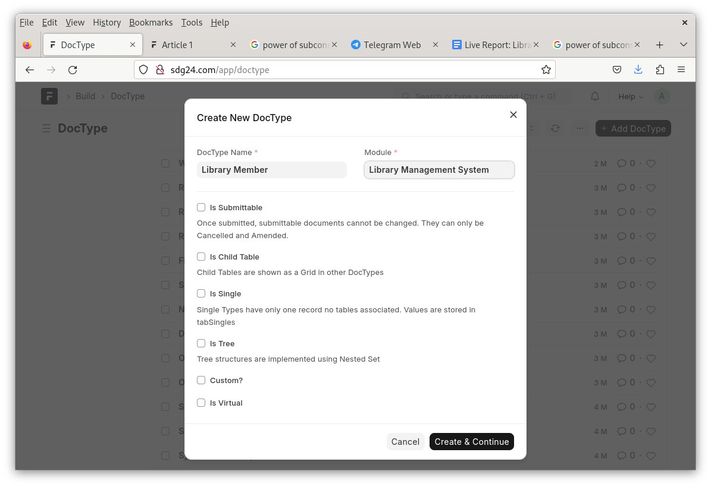
    - **Fields**:
      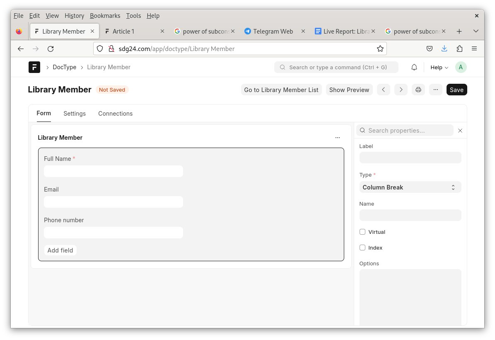
        - Full Name (Data, Mandatory)
        - Email Address (Data)
        - Phone (Data)
          Go to settings of library member doctype
    - Set **Naming** to `Autoincrement`.
      and fill name mem.####

      
    - Save the Doctype.

4 . add library member
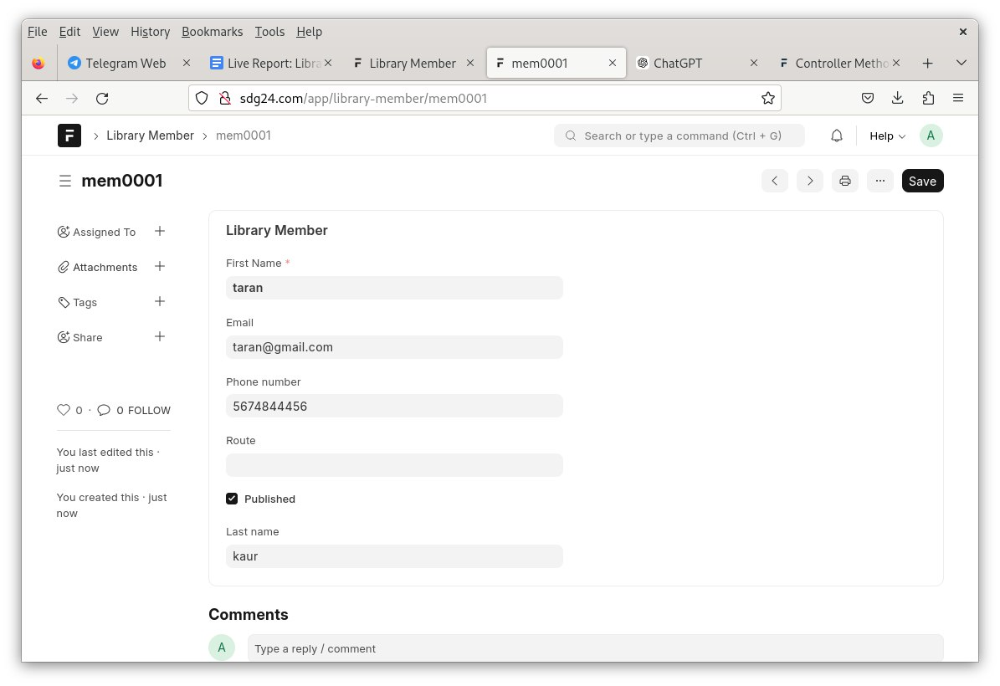
